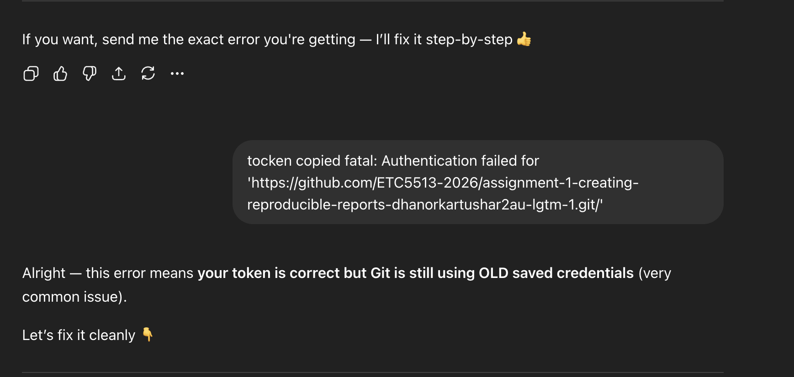
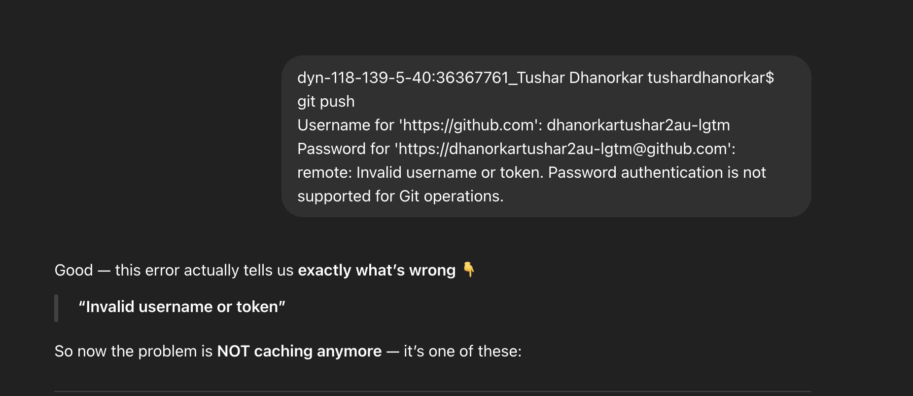
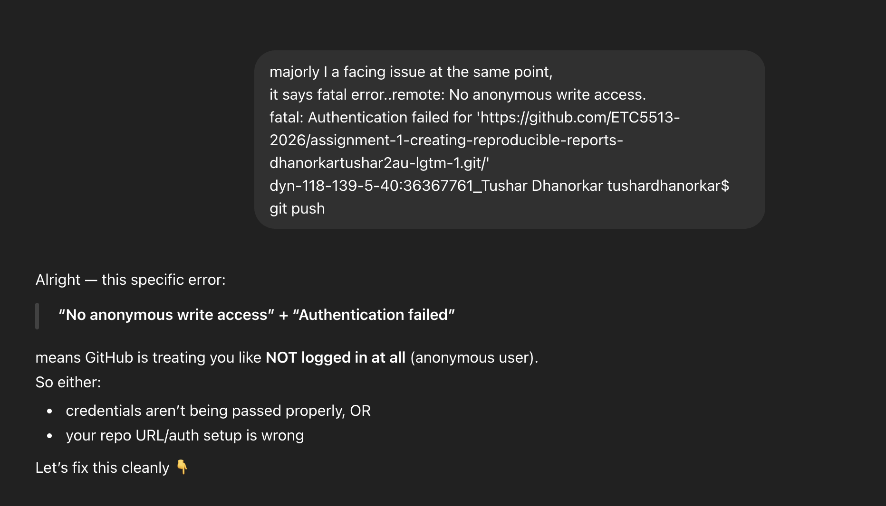
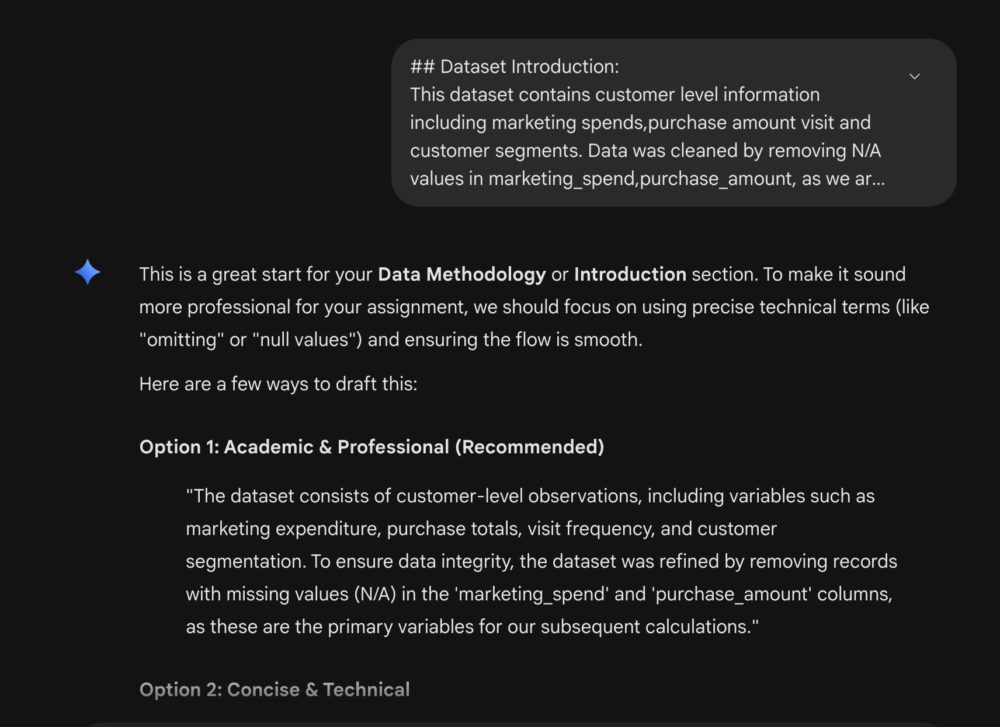
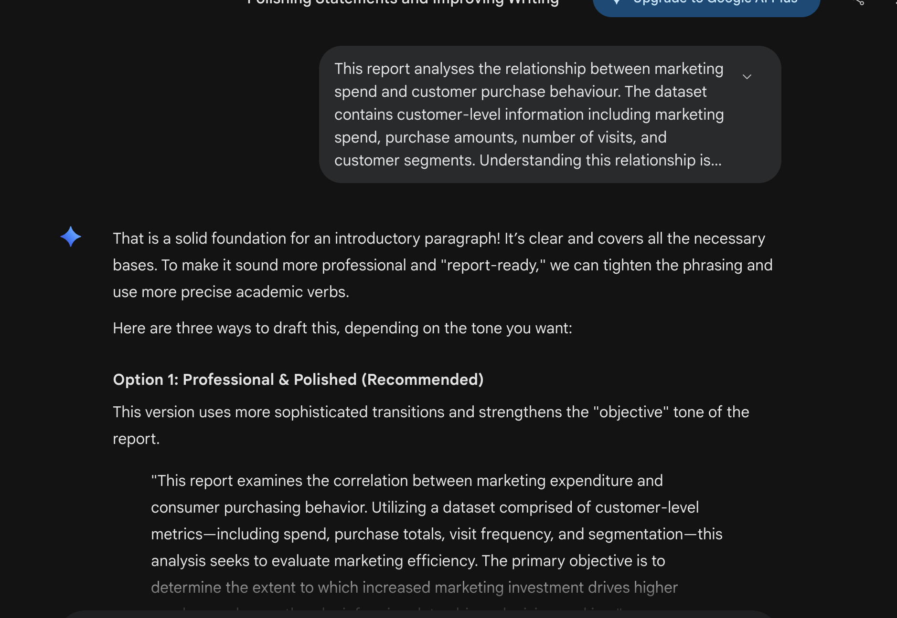
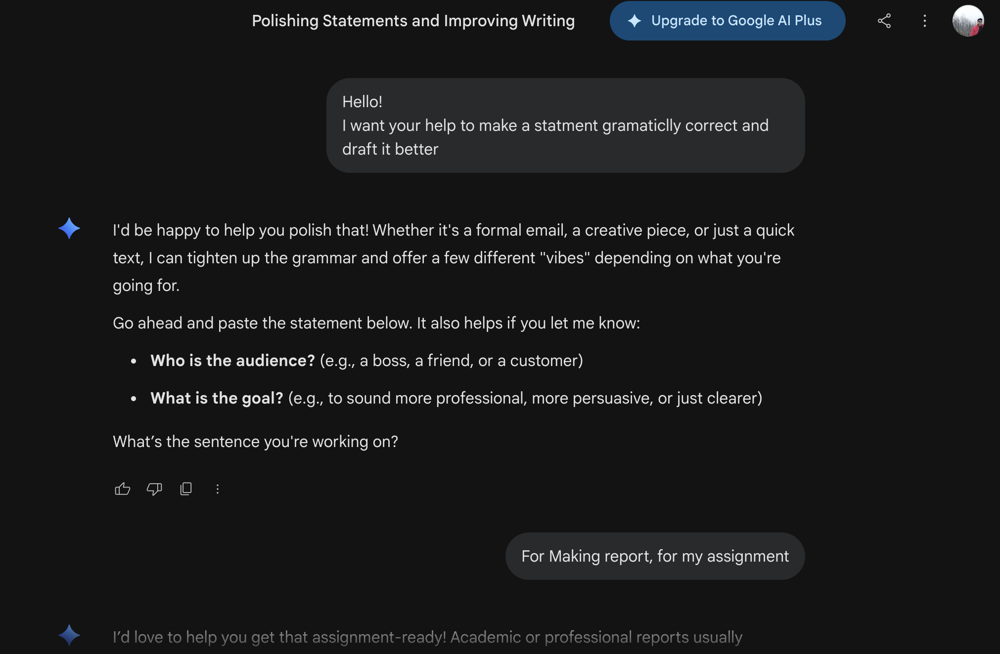
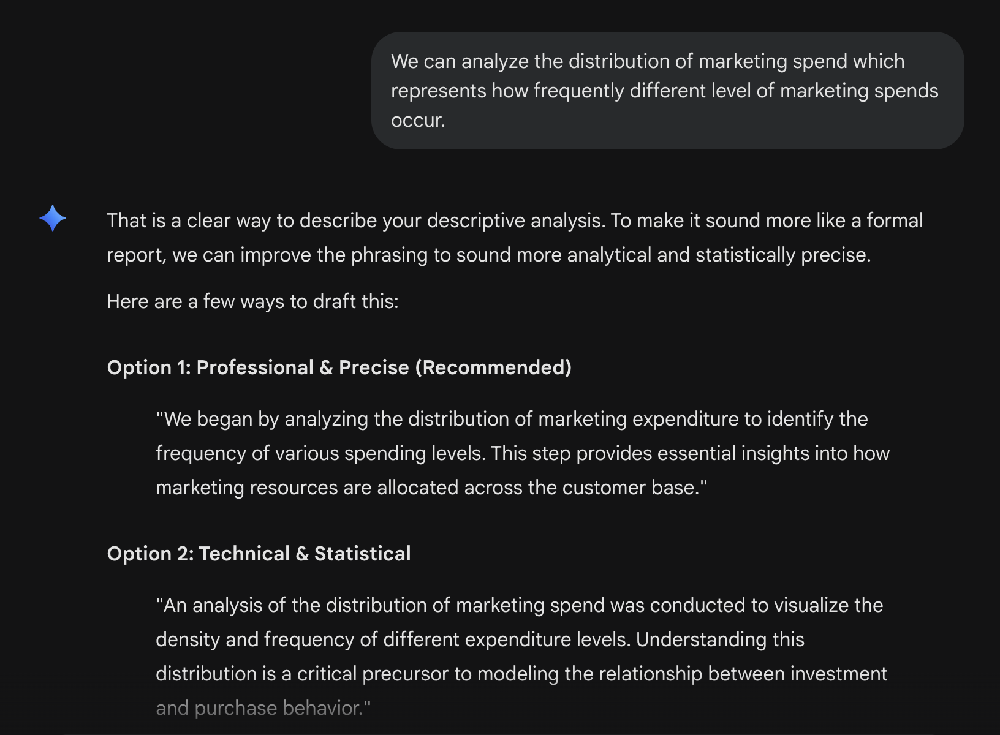

## Use of Generative AI

Generative AI tools (ChatGPT and Google Gemini) were used in this assignment in a limited and appropriate manner. Their use was restricted to grammar correction, improving the clarity of written statements, and resolving minor GitHub-related issues during the setup of the repository.

## GitHub Issue Resolution

During the assignment, an issue was encountered while committing and pushing changes to GitHub. Initially, the push was unsuccessful despite providing the correct username and credentials.

To resolve this issue, troubleshooting steps were followed, including installing the required Git-related dependencies through the console. After completing these steps, the issue was successfully resolved, and changes were committed and pushed to the repository.

### Supporting Screenshots

ChatGPT conversation:\
<https://chatgpt.com/share/69dc5eec-b674-8321-a4c1-870fc45df759>

## Use of AI for Writing Support

ChatGPT and Google Gemini were used to refine grammar and enhance the clarity of the written content. No AI tools were used to generate the core analysis, code, or results presented in this report.

### Supporting Screenshots

Google Gemini:\
<https://gemini.google.com/share/bf79c0481528>

## References

ChatGPT conversation:\
<https://chatgpt.com/share/69dc5eec-b674-8321-a4c1-870fc45df759>

Google Gemini:\
<https://gemini.google.com/share/bf79c0481528>
